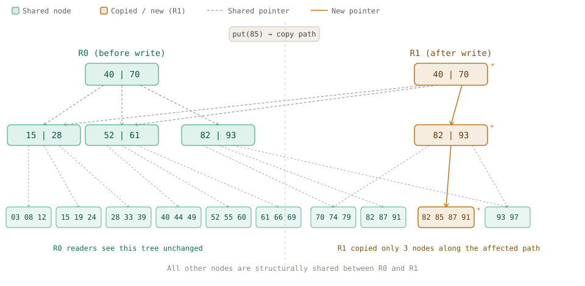

# persistent-index

`persistent-index` is a persistent ordered index built on a copy-on-write B+ tree.
It is designed for single-writer, multi-reader workloads enabling lock-free consistent snapshot reads during concurrent writes - Readers don't block writer. Writer don't block readers.

## Overview

The index stores keys in sorted order with values in leaf nodes. It supports point lookup, bounded range reads, ordered iteration, insert with replacement semantics, and delete with value return semantics.

The implementation includes full delete rebalancing across borrow, merge, propagation, and root collapse paths, so structural invariants are preserved throughout update and removal workflows.

## Architecture

### B+ Tree Core

`persistent-index` uses a B+ tree layout where internal nodes hold separator keys and child references, and leaf nodes hold key-value entries in sorted order. This keeps lookup depth bounded while preserving efficient ordered scans.

### Storage Abstractions

Tree logic is decoupled from key storage representation through `KeyStorage` and `KeyStorageFactory`.

- `ArrayKeyStorage` provides a generic baseline representation of keys.
- `PackedByteKeyStorage` provides a packed byte-array representation for memory-efficient byte-key workloads.

This separation allows storage layout optimization without entangling core tree algorithms.

### Copy-on-Write Updates

All structural changes are copy-on-write. A write operation rebuilds only the affected path and reuses untouched subtrees through structural sharing. This avoids in-place mutation and keeps version transitions explicit.

### Lock-Free Snapshot Reads

The concurrency model is single-writer, multi-reader. Readers traverse an immutable root snapshot and are never exposed to partial writes. The writer publishes a new root only after a complete update, allowing concurrent reads without reader-side locking.



**Write: put(85)**
1. Copy only the affected path: `R0 -> [82 | 93] -> [82 87 91]`
2. Insert into the copied leaf, producing `[82 85 87 91]`
3. Publish the new root pointer `R1`

**Read behavior**
- Before `R1` is published, readers continue on the existing `R0` snapshot
- After `R1` is published, new reads observe the `R1` snapshot

## Usage

### Creating an index

```java
import io.dsal.persistent.index.core.PersistentBPlusTree;
import io.dsal.persistent.index.layout.ArrayKeyStorageFactory;

var tree = new PersistentBPlusTree<Integer, String>(
        8,
        new ArrayKeyStorageFactory<>(Integer::compareTo)
);
```

### Writing (copy-on-write)

```java
tree.put(10, "Alic");
tree.put(20, "Bob");
tree.put(20, "John"); // replace 20 with "John"
tree.remove(10);
```

### Reading

```java
var value = tree.get(20);
var items = tree.range(0, 100);
```

### Iteration

```java
for (var entry : tree) {
    System.out.println(entry.key() + " -> " + entry.val());
}

var it = tree.rangeIterator(10, 50);
while (it.hasNext()) {
    var entry = it.next();
    System.out.println(entry.key() + " -> " + entry.val());
}
```

### Single writer, multiple readers (SWMR)

```java
final var tree = new PersistentBPlusTree<Integer, String>(
        8,
        new ArrayKeyStorageFactory<>(Integer::compareTo)
);

Thread writer = new Thread(() -> {
    tree.put(42, "Noah");
    tree.put(85, "Sophia");
    tree.remove(10);
});

Thread reader1 = new Thread(() -> {
    var snapshot = tree.iterator();
    while (snapshot.hasNext()) snapshot.next();
});

Thread reader2 = new Thread(() -> {
    var snapshot = tree.rangeIterator(0, 100);
    while (snapshot.hasNext()) snapshot.next();
});

writer.start();
reader1.start();
reader2.start();
```

### Packed byte key storage

```java
import io.dsal.persistent.index.layout.PackedByteKeyStorageFactory;
import io.dsal.persistent.index.layout.LexigographicPackedByteComparator;
import java.nio.charset.StandardCharsets;

var tree = new PersistentBPlusTree<byte[], String>(
        8,
        new PackedByteKeyStorageFactory(new LexigographicPackedByteComparator())
);

tree.put("alice".getBytes(StandardCharsets.UTF_8), "software_engineer");
tree.put("bob".getBytes(StandardCharsets.UTF_8), "architect");
```

## Project Status

The core implementation is complete and under active refinement. Current milestone work is focused on comprehensive testing strategy and performance benchmarking.

## Background

`persistent-index` was originally built as the indexing layer for [Axis](https://github.com/Rafee-Mohamed/axis), a strongly consistent distributed key-value store used for coordination, locking, and metadata management.

It was later extracted into a standalone component so the index can evolve independently while remaining reusable in other systems.

## Requirements

Java 25+

## License

TBD
